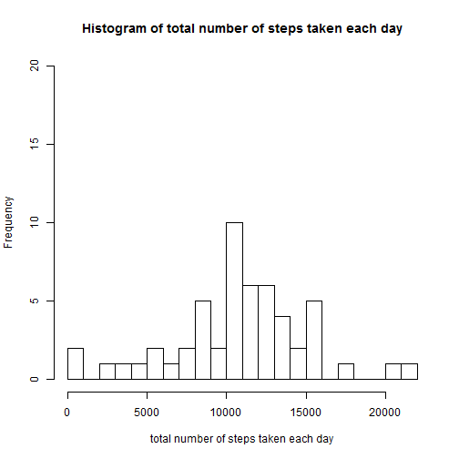
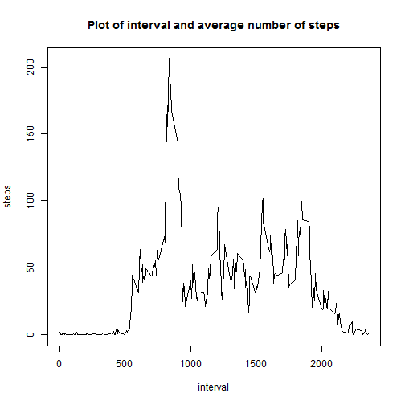
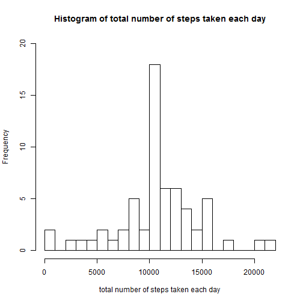

# Reproducible Research: Peer Assessment 1


## Loading and preprocessing the data

```r
activity<-read.csv("activity/activity.CSV")
activity_complete<- activity[complete.cases(activity),]
head(activity)
```

```
##   steps       date interval
## 1    NA 2012-10-01        0
## 2    NA 2012-10-01        5
## 3    NA 2012-10-01       10
## 4    NA 2012-10-01       15
## 5    NA 2012-10-01       20
## 6    NA 2012-10-01       25
```


## What is mean total number of steps taken per day?

The below plot is the histogram of the total number of steps taken each day


```r
total_step<-aggregate(steps ~ date, activity_complete , sum)
hist(total_step$steps,breaks=20,ylim=c(0,20),main="Histogram of total number of steps taken each day",xlab="total number of steps taken each day")
```

 


```r
step_mean<-mean(total_step$steps)
step_median<-median(total_step$steps)
```

The mean total number of steps taken per day is 10766.1887

The median total number of steps taken per day is 10765


## What is the average daily activity pattern?

The below plot is the time series plot of the 5-minute interval and the average number of steps taken, averaged across all days 


```r
average_daily_step<-aggregate(steps ~ interval, activity_complete , mean)
plot(average_daily_step,type="l",main="Plot of interval and average number of steps")
```

 


```r
max_average_step<-max(average_daily_step$steps)
which_interval<-which(average_daily_step$steps == max_average_step)
max_average_interval<-average_daily_step[which_interval,1]
```

Interval 835 contains the maximum number of steps 206.1698


## Imputing missing values


```r
incomplete_cases<-!complete.cases(activity)
number_na<-length(activity[incomplete_cases,1])
```

The total number of missing values in the dataset is 2304

I use the mean of the 5-minute interval if the steps value is missing, otherwise, just use the original value.


```r
filling_strategy <- function(activity_case){
        if(is.na(activity_case[1])){
                average_daily_step[average_daily_step$interval==as.integer(activity_case[3]),2]
        }else {
                as.integer(activity_case[1])
        }
}
```

Now we can create a new dataset based on the original one with the missing value filled. 


```r
new_activity<-read.csv("activity/activity.CSV")
new_steps<-apply(new_activity,1,filling_strategy)
new_activity$steps<-new_steps
head(new_activity)
```

```
##     steps       date interval
## 1 1.71698 2012-10-01        0
## 2 0.33962 2012-10-01        5
## 3 0.13208 2012-10-01       10
## 4 0.15094 2012-10-01       15
## 5 0.07547 2012-10-01       20
## 6 2.09434 2012-10-01       25
```

Histogram of the total number of steps taken each day for the new dataset


```r
new_total_step<-aggregate(steps ~ date, new_activity , sum)
hist(new_total_step$steps,breaks=20,ylim=c(0,20),main="Histogram of total number of steps taken each day",xlab="total number of steps taken each day")
```

 

```r
new_step_mean<-mean(new_total_step$steps)
new_step_median<-median(new_total_step$steps)
```

The mean total number of steps taken per day is 10766.1887

The median total number of steps taken per day is 10766.1887

The mean is the same with the estimates from the original dataset and the median becomes the same as the mean.

Imputing missing data makes the number of days with average total daily steps increase (From the histogram, we can see that the frequency of number of steps in range 10000~11000 increases)


## Are there differences in activity patterns between weekdays and weekends?

First, I add a new variable weekday in the dataset indicating whether a given date is a weekday or weekend.


```r
classify_weekday<-function(date){
                weekday<-weekdays(as.Date(date))
                if (weekday=="Saturday" || weekday=="Sunday"){
                        "weekend"
                }else{
                        "weekday"
                }
        }
new_activity$weekday<-as.factor(sapply(new_activity$date,classify_weekday))
head(new_activity)
```

```
##     steps       date interval weekday
## 1 1.71698 2012-10-01        0 weekday
## 2 0.33962 2012-10-01        5 weekday
## 3 0.13208 2012-10-01       10 weekday
## 4 0.15094 2012-10-01       15 weekday
## 5 0.07547 2012-10-01       20 weekday
## 6 2.09434 2012-10-01       25 weekday
```

Let's see the plot of the 5-minute interval and the average number of steps taken, averaged across all weekday days or weekend days


```r
average_weekday_step<-aggregate(steps ~ interval + weekday, new_activity, mean)
library(lattice)
xyplot(steps ~ interval | weekday, data = average_weekday_step, type="l", layout = c(1, 2), xlab="Interval", ylab="Number of steps")
```

 


